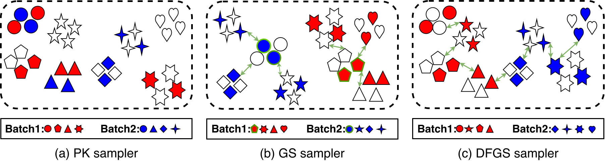
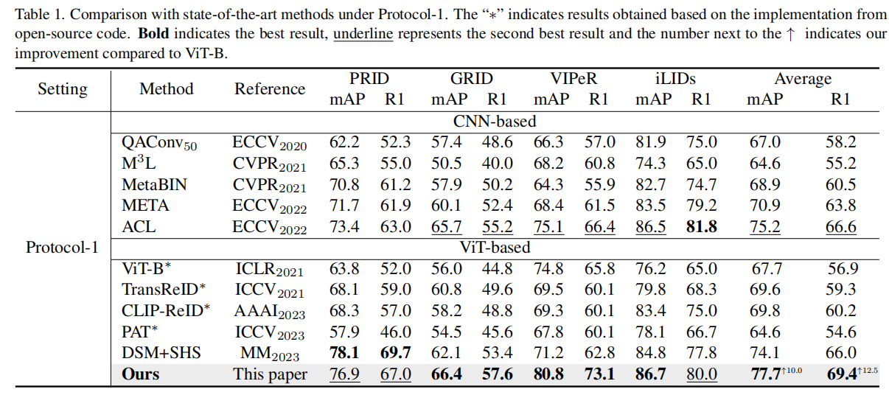

## Enhancing Robustness of ViT in Cross-domain Person Retrieval: A Domain Guided Framework via Depth First Graph Sampling




## Requirements

##### Our code is based on [fast-reid](https://github.com/JDAI-CV/fast-reid) and [TransReid](https://github.com/damo-cv/TransReID).

Thanks for their contributions.

*We will release the full code in the future.*

If you are using the above-mentioned framework, you just need to place  our DFGS code in the sampler package and import it for use.

Moreover, You need to prepare DeiT or ViT Pre-trained Models.


## Core Code

```python
class DepthFirstGraphSampler(Sampler):
    def __init__(self, data_source, batch_size, num_instances, domains, model, h_size=384, w_size=128, lamda=1.):
        super().__init__(data_source)
        self.data_source = data_source
        self.batch_size = batch_size
        self.num_instances = num_instances
        self.model = model
        self.num_pids_per_batch = self.batch_size // self.num_instances
        self.index_dic = defaultdict(dict)
        self.domain_info = {elm.lower(): 0 for elm in domains}

        for index, data in enumerate(self.data_source):
            if data[2] in self.index_dic[data[1]].keys():
                self.index_dic[data[1]][data[2]].append(index)
            else:
                self.index_dic[data[1]][data[2]] = [index]

            self.domain_info[data[-1].lower()] += 1
        self.pids = list(self.index_dic.keys())

        self.length = 0
        for pid in self.pids:
            num = sum([len(self.index_dic[pid][key]) for key in self.index_dic[pid].keys()])
            self.length += num
        self.lamda = lamda

        self.eval_transforms = T.Compose([
            T.Resize((h_size, w_size)),
            T.ToTensor(),
            nn.InstanceNorm2d(3),
        ])

    # sort for camera
    def sort_dic_cam(self, s):
        ks = list(s.keys())
        len_k = np.array([len(s[k]) for k in s.keys()])
        ix = len_k.argsort()[::-1]
        return {ks[i]: s[ks[i]] for i in ix}

    def __iter__(self):
        batch_idxs_dict = defaultdict(list)
        pids = copy.deepcopy(self.pids)
        random.shuffle(pids)
        print("Graph Structure Updating...")
        for pid in pids:
            dic_tmp = copy.deepcopy(self.index_dic[pid])
            cids = list(dic_tmp.keys())
            for cid in cids:
                random.shuffle(dic_tmp[cid])
            idxs = []
            while cids:
                num = 0
                dic_tmp = self.sort_dic_cam(dic_tmp)
                for cid in cids:
                    num += 1
                    idxs.append(dic_tmp[cid].pop())
                    if len(dic_tmp[cid]) == 0:
                        cids.remove(cid)
                    if num == self.num_instances:
                        break
            if len(idxs) <= 1:
                continue
            if len(idxs) < self.num_instances:
                idxs = np.random.choice(idxs, size=self.num_instances, replace=True)

            batch_idxs = []
            for idx in idxs:
                batch_idxs.append(idx)
                if len(batch_idxs) == self.num_instances:
                    batch_idxs_dict[pid].append(batch_idxs)
                    batch_idxs = []
        avai_pids = copy.deepcopy(pids)
        final_idxs = []

        model = copy.deepcopy(self.model).cuda().eval()
        index_dic = defaultdict(list)
        for index, data in enumerate(self.data_source):
            index_dic[data[1]].append(index)
        pids = list(index_dic.keys())
        inex_dic = {k: index_dic[k][random.randint(0, len(index_dic[k]) - 1)] for k in pids}
        feat_dist = {}
        choice_set = CommDataset([self.data_source[i] for i in list(inex_dic.values())], self.eval_transforms,
                                 relabel=False)
        choice_loader = DataLoader(
            choice_set, batch_size=128, shuffle=False, num_workers=8,
            collate_fn=val_collate_fn
        )

        feats = torch.tensor([]).cuda()
        scores = torch.tensor([]).cuda()
        for i, (img, pid, domain) in enumerate(choice_loader):
            with torch.no_grad():
                img = img.cuda()
                ### If you only have 'feat', please remove 'score' ###
                feat, score = model(img, domain)
                feats = torch.cat((feats, feat), dim=0)
                scores = torch.cat((scores, score), dim=0)

        dist_f = euclidean_dist(feats, feats)
        ### If you only have 'feat', please remove 'score' ###
        dist_s = euclidean_dist(scores, scores)
        dist_mat = dist_f + dist_s

        for i in range(len(dist_mat)):
            dist_mat[i][i] = float("inf")

        for i, feat in enumerate(dist_mat):
            feat_dist[pids[i]] = []
            loc = torch.argsort(feat)
            for j in range(4, 14):
                locj = int(loc[j].cpu())
                feat_dist[pids[i]].append(pids[locj])
        print("Graph Structure Update Completed!")
        print("Building Iteration...")
        batch_idxs = []
        is_pid = set()
        stack = deque([random.choice(list(avai_pids))])
        i = len(avai_pids)
        while stack and i:
            k = stack.pop()
            if k not in avai_pids:
                continue
            # If multiple consecutive PIDs already exist in the current batch, exit the loop.
            if k in is_pid:
                stack.appendleft(k)
                i -= 1
                continue
            # Reset the count of 'i' whenever a new PID enters the batch.
            i = len(avai_pids)
            batch_idxs.extend(batch_idxs_dict[k].pop(0))
            if len(batch_idxs_dict[k]) == 0:
                avai_pids.remove(k)
            # Mark the PID 'k' already exists in this batch.
            is_pid.add(k)
            # At the end of a batch, start counting anew for the next round.
            if len(batch_idxs) == self.batch_size:
                final_idxs.extend(batch_idxs)
                batch_idxs = []
                is_pid = set()
            # At the completion of a batch, start a new round.
            avai_k = list(feat_dist[k])
            # Depth-first
            for v in avai_k[::-1]:
                if v in avai_pids:
                    stack.append(v)
        torch.cuda.empty_cache()
        print("Completion of Iteration!")
        print(len(final_idxs))
        self.length = len(final_idxs)
        return iter(final_idxs)

    def __len__(self):
        return self.length

```


## Experiment

Our method has achieved excellent results.


