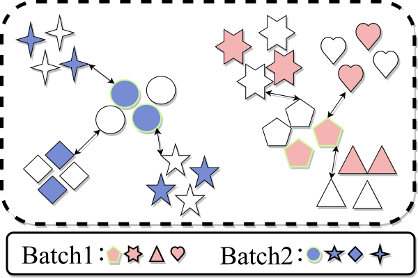
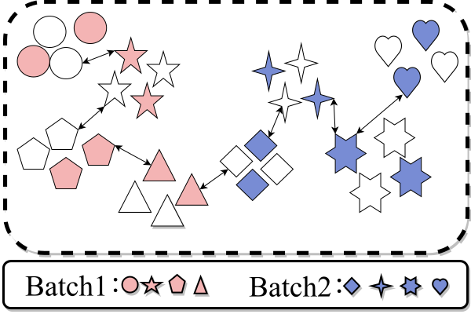
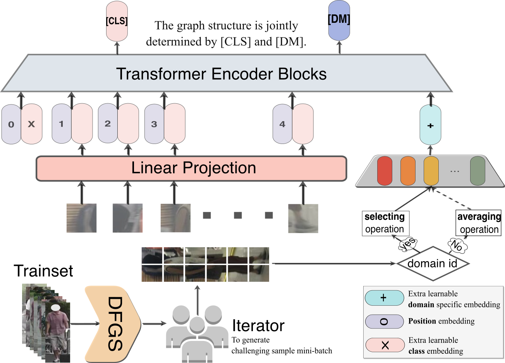

## Enhancing Robustness of ViT in Cross-domain Person Retrieval: A Domain Guided Framework via Depth First Graph Sampling

*We will release the full code in the future.*

### Pipeline

---

The GS sampler [GS](https://github.com/ShengcaiLiao/QAConv): 

Our DFGS sampler:  

**Overall pipeline  **

### Requirements

---

#### My code is based on [fast-reid](https://github.com/JDAI-CV/fast-reid) and [TransReid](https://github.com/damo-cv/TransReID).

Thanks for their contributions.

-> If you are using the above-mentioned framework, you just need to place  our DFGS code in the sampler package and import it for use.

#### Prepare DeiT or ViT Pre-trained Models.

